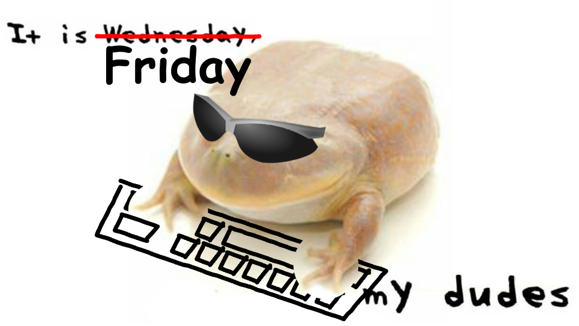
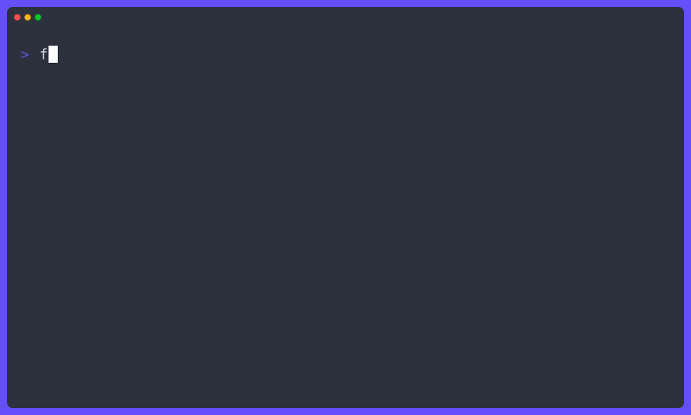

# It's ~~wednesday~~ friday my dudes

> Friday is a toy project to learn rust.
> It provides a CLI as well as a REST API to manage tasks to do on fridays.

## Demo

## TODOs

- error handling
  - use anyhow in binary crates, thiserror in libary crates
  - cleanup error enums to not be CLI specific
- server
  - add tracing spans to server and replace logs with tracing <https://docs.rs/tracing/latest/tracing/>
  - add middlewares
  - add graceful shutdown
